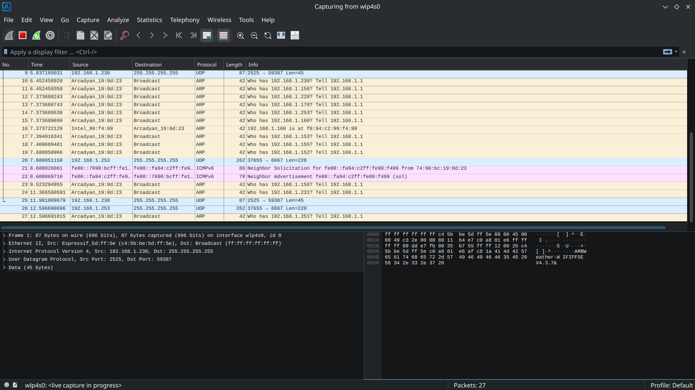

# wireshark-network-analysis-lab

## Purpose
Analyze network traffic and identify protocols using Wireshark

## Tools Involved
- Wireshark
- Debian
- Home Network

## Procedures
1. Install wireshark from Linux CLI
2. Capture network traffic
3. Apply filters to analyze protocols
4. Investigate packet details

## Filters
dns
http
icmp

## Findings
- HTTP packets expose plain text readable headers
- HTTPS encrypts packet data
- DNS requests expose domain queries

## Skills Demonstrated
- Packet analysis
- Security Monitoring
- Network protocol identification

## Packet Capture

## DNS Analysis

